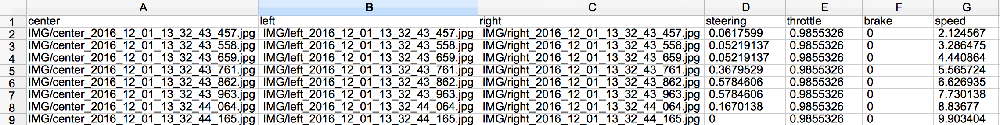
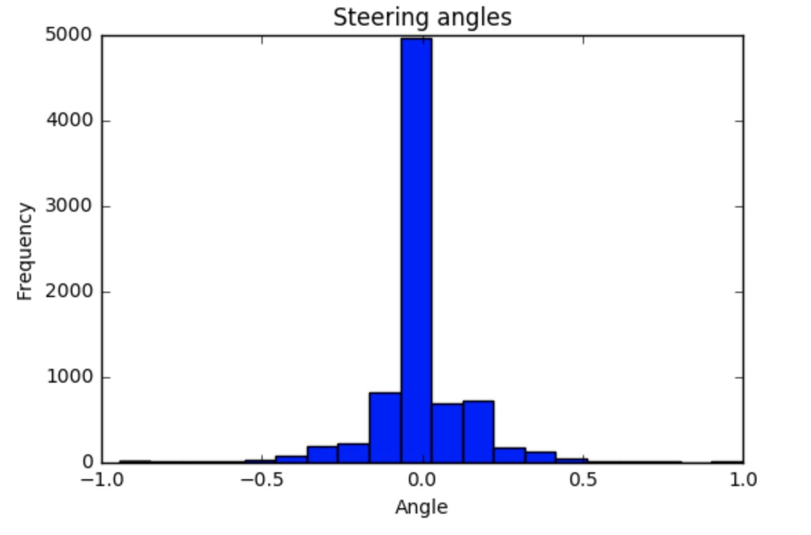
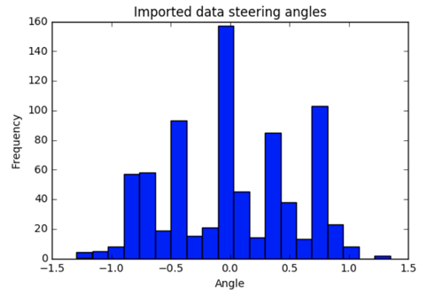
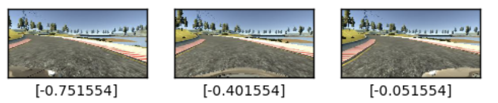
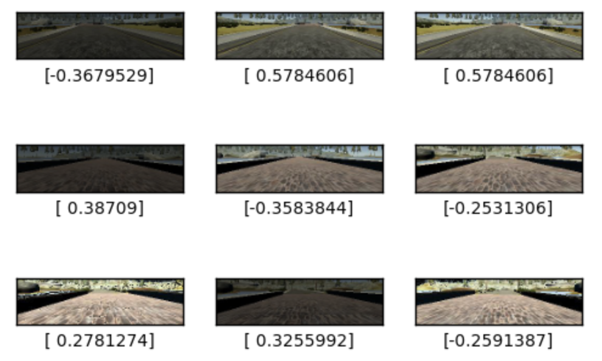

# Project 3. Behavioral cloning
## Udacity Self-driving car Nanodegree
## January 2017

In this project I have used a Convolutional Neural Network to teach a car to drive in a simulator.

### Data

The training data has been collected by a human driver using the simulator. There is a driving_log.csv that has logged the path to each still image or frame, the steering angle, throttle, brake and speed of the car in the training laps.
The car has three cameras: front facing, on the left and right of the car. This gives us three angles or perspectives of each training instant.

In this project we are only going to use the images and the steering angle of the training log.

Img 1. Training data log

The first step was to investigate the training data. The steering angles seem to have been normalized between -1 and 1.

The distribution of this data is not even, there are many more steering angles around zero.

Img 2. Distribution of the steering angles in the training data

In order to feed the Neural Network a more even distribution of angles and downsample the zero angles I only load angles above or below 0.35 steering values.
This results in a more even distribution.

Img 3. Distribution of the steering angles in the imported data

As the driving data recorded is correct driving we also need to teach the Neural Network to recover.
Instead of recording new recovery data I have added the left and right camera images to the data adding a correction of plus or minus 0.35, as the steering angles are in the range [-1,1] for an 180 degree perspective, so every degree would be equal to 1/90 = 0.0111 I have added about 35 degrees steering wheel turn to left/right images.

Img 4. We have hree angle perspectives for every training drive instant and I have corrected the steering values accordingly.

### Data preprocessing

The images are 320 x 160 pixels in three color channels.
I have resized the images to half their size in pixels to save memory.
I have also cropped the images to eliminate unwanted areas that don't provide important information, like the skyline or the car bonnet.
I have then changed their brightness level by a random value to simulate driving in different light conditions
I have added a random 50% chance of horizontal flipping of the image, multiplying the steering angle by -1, to even out the left and right distribution.

Img 5. Images with random brightness filters to simulate driving in different lighting conditions.

The data is split into 80% for training and 20% kept aside as validation data.
The data is then shuffled once more.

### Model

The model has been created using Keras's Sequential model.
The first layer is a Lamda layer that applies image normalization.
The second layer applies 32 convolution filters of size 3x3 each.
Followed by Relu and Maxpooling (2,2). Then another set of Convolution (32 x 3 x 3), Relu and Maxpooling (2,2)
The model so far outputs 3D feature maps (height, width, features), so I use a Flatten layer, Dense 64, Relu, Dropout 0.5 and a final Dense(1) that outputs the steering angle.

I have used and Adam optimizer and I used the MSE metric to measure the loss.

### Training

I have used a python generator to feed training and validation data to the model while training using the Keras fit_generator() function.
I have added a callback to the model so that it saves the best weights of each training session to file model.h5
I have used a batch size of 128 for 10 epochs.
The model is very fast as training takes under 5 minutes on a i7 CPU.
The model has been saved as model.json at the end of each training session.

### Testing

I have tested the model driving round the track in autonomous mode. The model has been trained with images from this track.

Img 6. Thumbnail of YouTube video, click to watch.

The real test is to see the car drive in autonomous mode around the second track, a track it has never seen before:

Img 7. Thumbnail of YouTube video, click to watch.

This would be the equivalent of the testing data, and shows that the model has not just learned to from the images, or learned the first track (overfitting) but has learned to drive.
