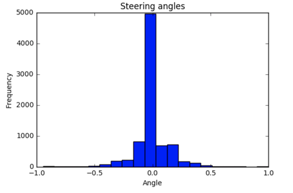
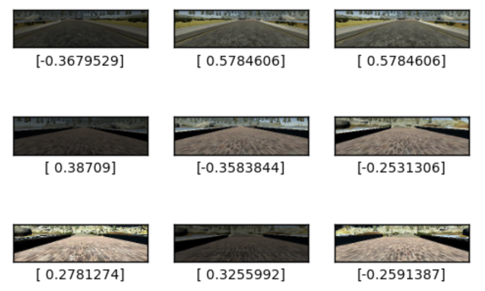

# Proyecto 3. Clonación Conductual
## Nanodegree de Coche Autónomo de Udacity
## Enero 2017

En este proyecto he utilizado una red neuronal convolucional para que un coche aprenda a conducir de forma autónoma en un simulador.

### Datos

Los datos de entrenamiento han sido recolectados por un conductor humano usando el simulador. Hay un archivo drive_log.csv que ha registrado cada imagen fija o fotograma del video, el ángulo de dirección, aceleración, freno y la velocidad del coche en las vueltas de entrenamiento.
El coche tiene tres cámaras: apuntando al frente, y una en cada lado del coche, izquierda y derecha. Esto nos da tres ángulos o perspectivas de cada instante de entrenamiento.

En este proyecto sólo vamos a utilizar las imágenes y el ángulo de dirección de los datos de entrenamiento.

Img 1. Transcripción de los datos grabados en el entrenamiento.

El primer paso fue investigar los datos de entrenamiento. Los ángulos de dirección parecen haberse normalizado entre -1 y 1.

La distribución de estos datos no es uniforme, hay muchos más ángulos de dirección en el entorno de cero.

Img 2. Distribución de los ángulos de dirección en los datos de entrenamiento.

Para alimentar a la Red Neural con una distribución más uniforme de los ángulos y rebajar los ángulos cero sólo cargo los ángulos por encima o por debajo del valor 0,35.
Esto da lugar a una distribución más uniforme.

Img 3. Distribución de los ángulos de dirección de los datos importados.

Como los datos registrados corresponden a una forma de conducir correcta también necesitamos enseñar a la Red Neural a recuperarse si se acerca a los bordes de la carretera.
En lugar de registrar nuevos datos de recuperación he añadido las imágenes de las cámaras izquierda y derecha a los datos añadiendo una corrección de más o menos 0,35, ya que los ángulos de dirección están en el rango [-1,1] para una perspectiva de 180 grados, por lo que cada grado equivale a 1/90 = 0.0111 He añadido alrededor de 35 grados de giro de volante a las imágens izquierda / derecha.

Img 4. Tenemos tres perspectivas para cada instante de las vueltas de entrenamiento  y he corregido los valores de dirección en consecuencia

### Preprocesamiento de datos

Las imágenes tienen 320 x 160 píxeles en tres canales de color.
He cambiado el tamaño de las imágenes a la mitad de su tamaño en píxeles para ahorrar memoria.
También se ha realizado un recorte de la imagen para eliminar zonas que no aportan información relevante, como las zonas de cielo y el capó del coche.
Luego he cambiado su nivel de brillo por un valor aleatorio para simular la conducción en diferentes condiciones de luz.
He añadido una probabilidad al azar del 50% de voltear la imagen horizontalmente, multiplicando el ángulo de dirección por -1, para igualar la distribución entre los giros de izquierda y derecha.

Img 5. Imágenes con filtros de brillo aleatorio para simular la conducción en diferentes condiciones de iluminación.

Los datos se dividen en un 80% para entrenamiento y un 20% para datos de validación.
Los datos se reordenaron de forma aleatoria una vez más.

### Modelo

El modelo has sido creado usando el Sequential de Keras.
La primera capa es una capa Lamda que aplica normalización a la imagen.
La segunda capa aplica 32 filtros de convolución de 3x3 de tamaño cada uno.
Seguido por Relu y Maxpooling (2,2). Luego otro conjunto de convolución (32 x 3 x 3), Relu y Maxpooling (2,2)
El modelo hasta ahora produce mapas de características en 3D (altura, anchura, características), por lo que utilizo una capa de aplanamiento, una Densa 64, Relu, Dropout 0.5 y una Densa final de 1 que genera el ángulo de dirección.

He utilizado el optimizador Adam y la métrica de MSE para medir la pérdida.

### Entrenamiento

He utilizado un generador de python para alimentar datos al modelo durante el entrenamiento usando la función fit_generator() de Keras.
He agregado un aviso (callback) al modelo para que guarde los mejores pesos de cada sesión de entrenamiento en el archivo model.h5
He utilizado un tamaño de lote de 128 durante 10 iteraciones.
El modelo es muy rápido, ya que el entrenamiento dura menos de 5 minutos en una CPU i7.
El modelo ha sido guardado como model.json al final de cada sesión de entrenamiento.

### Pruebas

He probado el modelo al hacerlo conducir alrededor de la pista en modo autónomo. El modelo ha sido entrenado con imágenes de esta pista número 1:

Img 6. Captura del video de la pista 1. Click para ver.

La prueba real es ver al coche conducir en modo autónomo en la segunda pista, una pista que nunca ha visto antes:

Img 7. Captura del video de la pista 2. Click para ver.

Esto sería el equivalente a los datos de prueba, y muestra que el modelo no se ha aprendido las imágenes de la primera pista (overfitting), ha aprendido a conducir.
